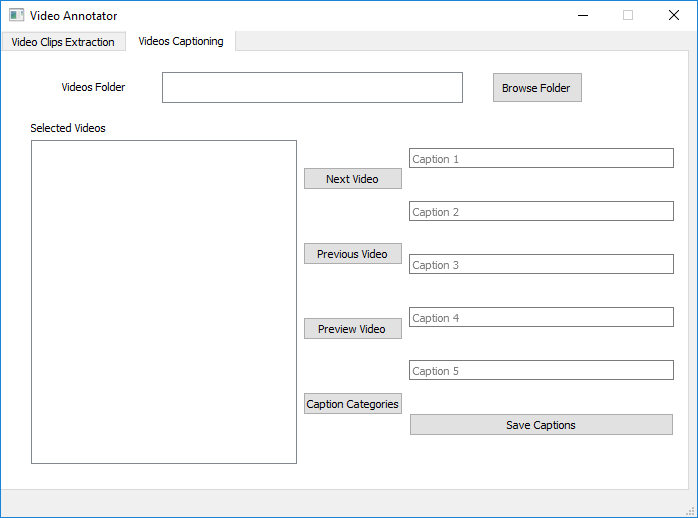

# Videos Annotator
Annotation tool for video clips
In Order to Train Video Clips By Descriptions, Manually Labeling every clip is tedious job.
Videos Annotator Helps to Automate Lot of Tasks and Saves Time.

Followings are current features:

## Generating Video Clips
- Generate Clips from the Videos Folder
- Generate Clips from Single Video input
- Specify Duration for Each Video Clip
- Automatic Data Folder Creation
## Labeling the Video Clips
- Select the Clips Folder to Annotate
- List of Loaded Clips
- Preview Any Clip
- Add up to 5 Captions for Every Clip
- Automatic Next Clip When Saving Captions for Current Clip
- Manually Switch between Next and Previous Clip
- Automatic Annotations Folder Creations

